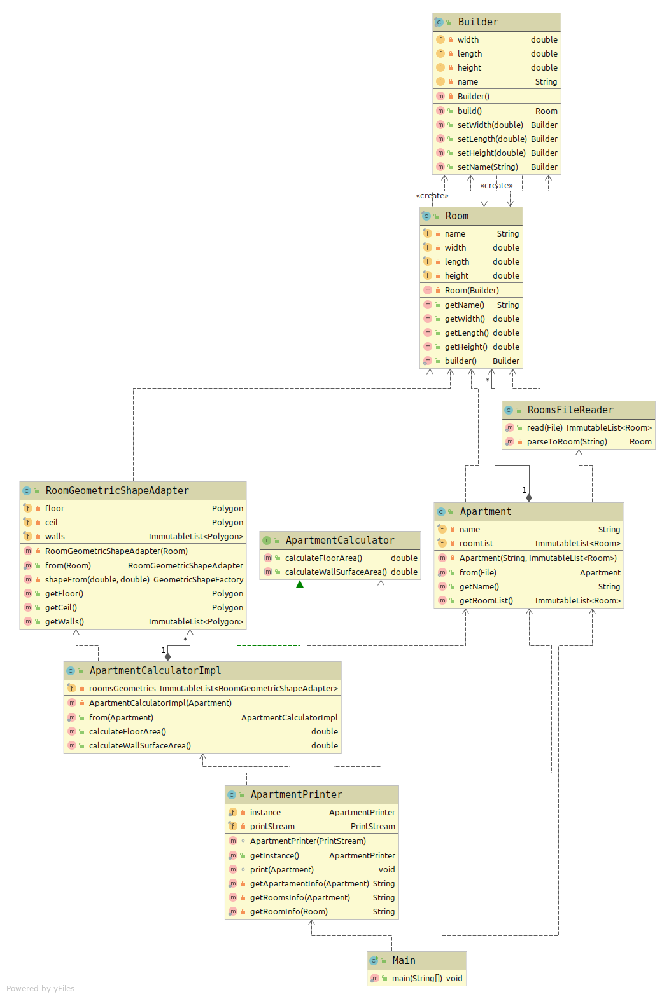

# Program obliczający parametry mieszkań

### 1. Opis programu
Program pozwala na obliczanie pola powierzchni podłóg oraz ścian w domu/mieszkaniu na podstawie danych pliku txt.  
W pliku zapisane są pomieszczenia, ich szerokość, długość oraz wysokość.  
Program oblicza pole powierzchni poszczególnych pomieszczeń oraz całkowity metraż domu.  
Dla uproszczenia zakładam, że wszystkie pomieszczenia mają kształt prostopadłościanu.

### 2. Format pliku txt wczytywanego przez program
Format pliku txt (wyrażone w metrach):
```
Nazwa pomieszczenia;szerokość;długość;wysokość;
```
Przykładowy format pliku txt:  
```
Kuchnia;4;3;2.5;
Salon;5;5;2.5;
Łazienka;2;3;2.5;
Salon;6;6;2.5;
```

### 3. Przykładowy wynik działania programu
  
```
##### Apartament Dom1 ##### 
	Powierzchnia podłóg: 79.0 m^2 
	Powierzchnia ścian:  170.0 m^2 
 
Kuchnia 
	Szerokość: 3.0 m^2 
	Długość:   4.0 m^2 
	Wysokość:  2.5 m^2 
Salon 1 
	Szerokość: 5.0 m^2 
	Długość:   5.0 m^2 
	Wysokość:  2.5 m^2 
Łazienka 
	Szerokość: 3.0 m^2 
	Długość:   2.0 m^2 
	Wysokość:  2.5 m^2 
Salon 2 
	Szerokość: 6.0 m^2 
	Długość:   6.0 m^2 
	Wysokość:  2.5 m^2  
```

<hr/>

### 4. Wykorzystane wzorce projektowe


Program wykorzystuje poniższe wzorce projektowe:
- Wzorzec <b>adapter</b> (klasa [RoomGeometricShapeAdapter](src/main/java/pl/com/muca/calculator/RoomGeometricShapeAdapter.java)).  
  Wykorzystuje on klasy <b>Shape</b>, <b>GeometricShapeFactory</b> z zewnętrznej biblioteki [Java Topology Suite](https://github.com/locationtech/jts)
- Wzorzec projektowy <b>budowniczy</b> (klasa [Room](src/main/java/pl/com/muca/apartment/Room.java)).
- Wzorzec projektowy <b>singleton</b> (klasa [ApartmentPrinter](src/main/java/pl/com/muca/ApartmentPrinter.java)).

<hr/>

### 5. Diagram klas UML

Diagram można znaleźć w plikach projektu (<b>diagram_klas_uml.png</b>).  


### 6. Autor projektu

Damian Muca  
Informatyka, studia niestacjonarne I stopnia   
Grupa L2, numer indeksu: 137271   
